# Janus

Janus is a research-grade market-data validation pipeline. It ingests provider
or settlement data, applies point-in-time and contract guards, prepares
asset-aware features, builds purged walk-forward folds, writes reproducible run
artifacts, and serves those artifacts through a React/FastAPI dashboard.

It is built to answer a narrow question:

```text
Can this data, validation path, and run lineage be trusted?
```

Janus does not pick instruments, generate production trading signals, or execute
orders. When strategy P&L columns are absent, metrics are reported as market
diagnostics rather than strategy backtest approval.

## Current Status

The actively supported workflows are:

- Equity diagnostics from provider data.
- Futures and futures-options diagnostics from pipe-delimited settlement files.
- WTI futures-options runs using a hash-pinned local settlement file.
- Contract/quarantine, coverage, CDC, break ledger, reports, and dashboard scan.
- **Greek-only computation** from prepared rows or instrument config without
  running the full pipeline.

Recent additions include:

- **Greek-only runner** (`run_greeks.py`): compute option Greeks independently
  using Black-76 or BSM, with numpy/loop/auto/cuda backends, universe filters,
  and a structured JSON summary — without touching splitter, metrics, or
  reporting stages
- **Vectorized Greek engine** (`core/greeks.py`): `batch_greeks()` shared by
  the full pipeline and Greek-only mode; corrected Black-76 theta with
  `exp(−rT)` discount factor on the volatility-decay term
- **Greek input resolver** (`core/greek_inputs.py`): strict column-precedence
  contract, numeric coercion of bad inputs, `greek_invalid_reason` column,
  never crashes on malformed rows
- **Independent reference validation**: `tools/generate_greek_reference.py`
  produces scipy-based Black-76/BSM reference values with no shared code paths
  with `core/greeks.py`
- expiry-aware option purge through `label_end_col: expiry`
- embargo support on the expiry-aware purge path
- option universe filters for DTE, minimum premium, IV cap, delta bands, and
  relative spread
- hash-pinned local file acceptance without `--allow-unversioned-data`
- settlement `net_change` checks at contract identity grain
- futures curve outlier checks at delivery-month grain
- sampled provided-IV validation for large option chains
- **option universe exclusion observability**: `summary.json` now explains why
  each option row was excluded (DTE, premium, IV, delta, spread, missing
  underlying) rather than reporting a single opaque row-drop count
- **option quality summary**: `summary.json` includes `option_quality` with IV
  rates, delta coverage, PCP flags, and universe exclusion reasons
- **equity option price provenance**: `price_source` (mid/last/missing),
  bid-ask spread, and relative spread columns added to equity option chain output

## Pipeline Shape

```mermaid
flowchart LR
    %% Janus compact high-level architecture for one-slide placement.
    %% Source of truth: docs/architecture/high_level_architecture.mmd

    classDef lane fill:#ffffff,stroke:#777777,stroke-width:1px,color:#111111;
    classDef input fill:#f8f2df,stroke:#9b7a25,stroke-width:1px,color:#2d2614;
    classDef data fill:#f2f2f2,stroke:#555555,stroke-width:1px,color:#111111;
    classDef proc fill:#ffffff,stroke:#111111,stroke-width:1px,color:#111111;
    classDef gate fill:#fff4ed,stroke:#b65f2a,stroke-width:1px,color:#3b1f0e;
    classDef out fill:#f6f0ff,stroke:#7556a8,stroke-width:1px,color:#28183f;
    classDef side fill:#ffffff,stroke:#777777,stroke-width:1px,stroke-dasharray:4 3,color:#333333;

    subgraph C["1. Control Inputs"]
        direction TB
        C1["Instrument file<br/>(YAML)"]:::input
        C2["Family defaults"]:::input
        C3["Data rules<br/>(contracts)"]:::input
        C4["Run mode<br/>full / Greeks"]:::input
        C1 --> C2 --> C3 --> C4
    end

    subgraph P["2. Data Preparation"]
        direction TB
        P1["Source data<br/>providers / files"]:::data
        P2["Pinned version<br/>+ known-at time (PIT)"]:::data
        P3{"Bronze gate<br/>schema / PIT / SLA"}:::gate
        P4["Asset prep<br/>(adapter)"]:::proc
        P5["Prepared frame"]:::data
        P6["Quarantine<br/>failed rows + reasons"]:::out
        P1 --> P2 --> P3
        P3 -->|pass| P4 --> P5
        P3 -->|fail| P6
    end

    subgraph V["3. Core Validation Pipeline"]
        direction TB
        V1["Check values<br/>(validators)"]:::proc
        V2["Quality score<br/>(DQ)"]:::proc
        V3["Compare changes<br/>(CDC)"]:::proc
        V4["Issue log<br/>(break ledger)"]:::proc
        V5["Time split<br/>+ no overlap"]:::proc
        V6["Stability<br/>+ metrics"]:::proc
        V7["Greek engine<br/>(batch_greeks)"]:::side
        V1 --> V2 --> V3 --> V4 --> V5 --> V6
    end

    subgraph O["4. Durable Outputs"]
        direction TB
        O1["Run package<br/>summary / report / tables"]:::out
        O2["Review package<br/>diffs / issues / manifest / lineage"]:::out
        O3["Dashboard<br/>inspect + investigate"]:::out
        O1 --> O3
        O2 --> O3
    end

    C4 --> P1
    P5 --> V1
    V6 --> O1
    V3 --> O2
    V4 --> O2
    V6 --> O2

    C4 -. Greeks only .-> V7
    P4 -. option prep .-> V7
    V7 -. Greeks .-> O1

    class C,P,V,O lane
```



The README diagram follows `docs/architecture/high_level_architecture.mmd`, which
is the source of truth for the high-level pipeline shape. More detailed execution
and paper-friendly section diagrams live in `docs/architecture/`.

## Install

```bash
pip install -r requirements.txt
```

Optional interactive progress bars use `tqdm` when it is installed. Without it,
Janus falls back to the existing plain logs:

```bash
pip install tqdm
```

Run the full test suite:

```bash
python3 -m pytest -q
```

Expected current result (on `feature/greek-engine`):

```text
468 passed, 3 skipped
```

## Quick Start: WTI Settlement Options

The local WTI instrument config is intentionally ignored because it contains a
machine-specific file path. Start from the example:

```bash
cp configs/instruments/wti.yaml.example configs/instruments/wti.yaml
shasum -a 256 /absolute/path/to/WTI.csv
```

Edit `configs/instruments/wti.yaml`:

```yaml
data_file: "/absolute/path/to/WTI.csv"
data_version: sha256:<file-sha256>
data_file_sha256: <file-sha256>
```

Then run a known-good WTI window:

```bash
python3 run_pipeline.py \
  --instrument wti \
  --start 2024-09-25 \
  --end 2024-12-31 \
  --run-id wti_q4
```

The hash-pinned local file satisfies the fixed-input guard. Use
`--allow-unversioned-data` only for exploratory provider/source reads where you
explicitly accept non-reproducible raw inputs.

Observed smoke result for the current local WTI file:

```text
Ingestion: 267185 rows loaded
Bronze gate: 0 rows quarantined
Coverage SLA: ok - 59/70 trading days
Adapter: 179665 rows prepared
Validators: 0 bound flags, 0 price outliers capped
CDC: 0 UNATTRIBUTED, 0 breaks
Splitter: 6 folds
```

The Q4 smoke still has `0` folds passing the regime diversity gate. That is a
calibration/sample issue, not a pipeline crash.

## Quick Start: Equity Diagnostics

Exploratory equity runs may read directly from the provider:

```bash
python3 run_pipeline.py \
  --instrument TSLA \
  --start 2020-01-01 \
  --end 2024-12-31 \
  --allow-unversioned-data
```

For a ticker without a YAML file, `--instrument` can be the ticker:

```bash
python3 run_pipeline.py -i NVDA --start 2024-01-01 --end 2024-12-31 --allow-unversioned-data
```

## Quick Start: Greek-only Mode

Compute Greeks from prepared option rows without running the full pipeline:

```bash
# From a prepared CSV (Black-76, WTI futures options)
python3 run_greeks.py \
  --input wti_options.csv \
  --model black76 \
  --backend numpy \
  --output outputs/greeks/wti_greeks.parquet

# From a prepared CSV (BSM, equity options with dividend yield)
python3 run_greeks.py \
  --input aapl_options.csv \
  --model bsm \
  --div-yield 0.005 \
  --rf-rate 0.05 \
  --output outputs/greeks/aapl_greeks.parquet

# From instrument config and raw chain
python3 run_greeks.py \
  --instrument wti \
  --data-file data/WTI_2024.csv \
  --start 2024-01-01 \
  --end 2024-12-31 \
  --min-dte 1 \
  --max-dte 90 \
  --output outputs/greeks/wti_2024.parquet
```

Greek-only mode writes two artifacts beside the output file:
- The Greek output file (CSV or Parquet) with `delta`, `gamma`, `vega`,
  `theta`, `rho`, `greek_model`, `greek_backend`, `greek_dtype`,
  `greek_input_valid`, and `greek_invalid_reason` columns.
- A `.greek_summary.json` file with `schema_version`, model/backend/dtype,
  universe filter counts, input quality counts, convention metadata,
  and provenance (git commit, input hash).

Invalid rows (missing underlying, IV, T, or bad right) receive `NaN` for all
Greek columns. The runner never raises on individual bad rows.

See `docs/guides/greek_only_runner.md` for the full API reference.

## CLI Rules

`run_pipeline.py` separates instrument identity from file location:

- `--instrument` / `-i`: instrument config name or equity ticker
- `--data-file`: local settlement file path
- `--provider`: optional provider override
- `--allow-unversioned-data`: bypass fixed-input guard for diagnostics only

Do not pass a CSV path to `--instrument`; Janus will treat it as an instrument
name or ticker.

Examples:

```bash
# Settlement-backed instrument using config data_file
python3 run_pipeline.py -i wti --start 2024-09-25 --end 2024-12-31

# Settlement-backed instrument overriding the file path
python3 run_pipeline.py \
  -i wti \
  --provider settlement \
  --data-file "/absolute/path/to/WTI.csv" \
  --start 2024-09-25 \
  --end 2024-12-31
```

If `--data-file` points to a different file than the hash pinned in the config,
the fixed-input guard fails.

### Runtime Overrides

Large option chains can be narrowed from the CLI without editing instrument YAML:

```bash
python3 run_pipeline.py \
  -i wti \
  --start 2024-09-25 \
  --end 2024-12-31 \
  --max-dte 90 \
  --min-option-price 0.00001 \
  --iv-cap 2.0 \
  --min-abs-delta 0.15 \
  --max-abs-delta 0.80 \
  --compute-greeks
```

Supported runtime controls:

- `--compute-greeks` / `--no-compute-greeks`
- `--metrics-mode auto|diagnostic|buy_and_hold|strategy_required`
- `--min-dte`, `--max-dte`, `--min-option-price`, `--iv-cap`
- `--min-abs-delta`, `--max-abs-delta`
- `--n-folds`, `--embargo-bars`
- `--progress auto|bar|plain|none`

CLI values override instrument YAML, which overrides family defaults.

Progress bars are additive and write to stderr; existing stage logs remain on
stdout. `--progress auto` shows bars only for an interactive terminal with
`tqdm` installed, `plain` keeps the historical logs only, and `none` suppresses
both bars and stdout logs for batch runs.

## Greek Engine

Janus has a single shared Greek engine used by both the full pipeline
(`run_pipeline.py`) and the standalone runner (`run_greeks.py`).

```
Full pipeline:   run_pipeline.py → OptionsBase.compute_greeks() ──┐
                                                                   ├→ core.greeks.batch_greeks()
Greek-only mode: run_greeks.py   → run_greek_only() ─────────────┘
                                 → core.greek_inputs.resolve_greek_inputs()
```

### Models

| Flag | Model | Use for |
|------|-------|---------|
| `--model black76` | Black-76 | Futures options (WTI, grains) |
| `--model bsm` | Black-Scholes-Merton | Equity options (AAPL, SPX) |

### Backends

| Flag | Backend | Notes |
|------|---------|-------|
| `--backend numpy` | CPU vectorized (default) | ~40–50× faster than loop |
| `--backend loop` | Scalar per-row | Debugging only |
| `--backend auto` | Automatic | numpy unless GPU threshold met |
| `--backend cuda` | GPU via CuPy | Requires `cupy-cuda12x` |

### Convention reference

**Theta** is annualized calendar-time decay: `−dV/dT` where `T` is in years.
To convert to per-day: `theta_per_day = theta / 365`.

Black-76 call theta:
```
θ = −e^(−rT) · F · φ(d₁) · σ / (2√T)
    − r · K · e^(−rT) · N(d₂)
    + r · F · e^(−rT) · N(d₁)
```

**Vega** is per 1.0 volatility unit (not per 1% move).
To convert to per-1% move: `vega_per_pct = vega / 100`.

**Rates** are continuously compounded.

## WTI Options Controls

The WTI example narrows the chain before expensive validation:

```yaml
pricing:
  model: black76
  validate_provided_iv: true
  iv_validate_sample_size: 5000
  compute_greeks: false
  check_pcp: false

option_universe:
  min_dte_days: 1
  max_dte_days: 730
  min_option_price: 0.00001
  # max_iv: 2.0
  # delta_band:
  #   min_abs_delta: 0.15
  #   max_abs_delta: 0.80
```

Why these defaults exist:

- `DTE=0` WTI option rows can have legitimate zero premium; they are filtered
  before pricing/metrics instead of being quarantined at the bronze gate.
- Very long-dated options dominate runtime and purge behavior while often being
  outside the intended research universe.
- Provided-IV validation is sampled so large chains remain usable.
- Greeks and PCP can be enabled after the universe is narrowed or run offline
  via `run_greeks.py`.

## Option Universe Exclusion Observability

Every option row excluded by a universe filter is counted by reason rather than
reported as a single opaque row-drop. Counts appear in `summary.json` under
`option_quality.universe`:

```json
{
  "option_quality": {
    "option_rows": 1000,
    "support_future_rows": 120,
    "universe": {
      "rows_before": 1500,
      "rows_after": 1000,
      "drop_rows": 500,
      "drop_by_reason": {
        "dte_below_min": 200,
        "dte_above_max": 150,
        "premium_below_min": 100,
        "iv_above_cap": 40,
        "iv_missing_or_unsolved": 5,
        "delta_above_max": 5,
        "spread_above_max": 0,
        "missing_underlying_future": 0
      },
      "filters": {
        "min_dte_days": 1,
        "max_dte_days": 730,
        "min_option_price": 0.00001
      }
    }
  }
}
```

Design invariant: a row excluded by DTE, premium, IV cap, delta band, or spread
is a **research universe choice** and is never quarantined at the bronze gate.
A row failing a contract structural or PIT rule is still quarantined as before.
The two counts must never overlap.

## Futures Options Semantics

`SettlementLoader` reads pipe-delimited EOD settlement files that mix futures and
options rows. It classifies rows with:

```text
is_option = CONTRACT TYPE in ["C", "P"] and STRIKE is not null
```

`FuturesOptionsAdapter` then:

- builds futures context and term-structure features
- attaches the matching same-date, same-delivery future price as option `F`
- computes DTE through `core/dte.py`
- applies configured option-universe filters
- uses Black-76 for futures options
- passes `label_end_col: expiry` to the splitter

Walk-forward validation is grouped by `as_of_date`. For option chains, purge
removes training rows whose label horizon reaches into validation, and embargo
removes rows too close to the validation start.

## Outputs

Run-scoped outputs use the current layout:

```text
outputs/runs/<instrument>/<run_id>/
  summary.json
  report/final_report.html
  report/summary_report.md
  tables/per_fold.csv
  tables/per_regime.csv
  tables/diversity.csv
  data/prepared.csv
  data/prepared.parquet
```

Global or cross-run artifacts:

```text
outputs/diff/<run_id>_changes.jsonl
outputs/diff/<run_id>_diff.html
outputs/breaks/<run_id>.jsonl
outputs/manifest/<run_id>.json
quarantine/<run_id>/
```

Greek-only outputs:

```text
outputs/greeks/<name>.parquet          # Greek columns + identity columns
outputs/greeks/<name>.greek_summary.json  # counts, conventions, provenance
```

Each `summary.json` includes guard status for PIT timing, contract gate,
coverage SLA, fixed input version, strategy P&L presence, and adjustment
semantics.

## Evidence Search Harness

The evidence harness investigates return outliers by searching the web, fetching
pages, extracting claims with an LLM, and writing a verdict to disk. It is an
optional module wired into the dashboard — outliers in the "Tagged return
outliers" panel can be investigated in one click.

### Architecture

```text
core/evidence_harness/
├── controller.py        # orchestration loop
├── config.py            # HarnessConfig + load_harness_config()
├── schema.py            # OutlierCasePackage, EvidenceClaim, SourceRegistryRecord, …
├── llm/
│   ├── router.py        # build_llm_client() + three task functions
│   ├── client.py        # LLMClient base class
│   └── providers/
│       ├── mock.py      # deterministic stub — default, no network
│       ├── ollama.py    # local Ollama (gemma4:26b, llama3, etc.)
│       └── openai_compat.py  # any OpenAI-compatible endpoint
web/evidence_api.py      # FastAPI routes: /api/evidence/run, /cases, /runs/{id}/outliers
```

No model name or provider is hardcoded in Python source. All LLM settings live
in config only:

| Field | Default | Override |
|---|---|---|
| `llm_provider` | `mock` | `ollama` or `openai_compat` |
| `llm_model` | `mock-v1` | any tag (`gemma4:26b`, `gpt-4o`, …) |
| `llm_base_url` | `http://localhost:11434` | any endpoint |
| `llm_api_key` | none | `${ENV_VAR}` interpolation supported |
| `llm_timeout_sec` | 60 | increase for large local models |

### Running with Ollama

Pull a model once:

```bash
ollama pull gemma4:26b
```

Enable in `configs/evidence_search.yaml`:

```yaml
evidence_search:
  enabled: true
  mode: live
  search_provider: duckduckgo
  fetch_provider: httpx
  max_runtime_sec: 300
  llm_enabled: true
  llm_provider: ollama
  llm_model: gemma4:26b
  llm_timeout_sec: 180
```

Start the dashboard and click **Investigate** on any outlier row.

### Evidence API routes

| Route | Purpose |
|---|---|
| `POST /api/evidence/run` | Submit an outlier case for investigation |
| `GET /api/evidence/cases/{case_id}/status` | Poll job status, sources, claims |
| `GET /api/evidence/runs/{run_id}/outliers` | List all outlier cases for a run |

### Providers

| `llm_provider` | Requirement | Notes |
|---|---|---|
| `mock` | none | Deterministic stub, safe for CI |
| `ollama` | `ollama` running locally | `gemma4:26b` tested; any pulled model works |
| `openai_compat` | API key | Works with OpenAI, Together, Fireworks, etc. |

Artifacts are written to `outputs/evidence/harness/{run_id}/{case_id}/{harness_run_id}/`:

```text
verdict.json
claims.jsonl
sources.jsonl
summary.json
```

Status endpoint reads artifacts from disk — results survive server restarts.

## Dashboard

Build the frontend once:

```bash
cd web/frontend
npm install
npm run build
cd ../..
```

Start the FastAPI dashboard server:

```bash
python3 run_dashboard.py
```

Open:

```text
http://127.0.0.1:8800/
```

Frontend development:

```bash
cd web/frontend
npm run dev
```

Vite serves the app at `http://127.0.0.1:5173/` and proxies API calls to the
FastAPI server.

Main dashboard/API routes:

| Route | Purpose |
| --- | --- |
| `/` | React dashboard |
| `/api/runs` | Scan run outputs |
| `/api/runs/{run_id}` | Run detail, breaks, warnings, samples |
| `/api/runs/{run_id}/raw-row` | Raw-source row lookup |
| `/api/breaks` | Break ledger filters |
| `/api/trend` | Break trend summary |
| `/api/compare?a=&b=` | Prepared-data diff |
| `/diff/{run_id}` | Static CDC diff HTML |
| `/report/{run_id}` | Static final report HTML |
| `/healthz` | Health check |

## Project Layout

```text
janus/
├── run_pipeline.py              # full pipeline CLI
├── run_greeks.py                # Greek-only CLI (no splitter/metrics/reports)
├── run_dashboard.py
├── configs/
│   ├── equity.yaml / futures.yaml
│   ├── instruments/bz.yaml / spx.yaml / aapl.yaml / wti.yaml.example
│   └── symbology/product_map.yaml
├── contracts/
├── ingestion/
│   └── equity_options_loader_yf.py   # price_source / spread provenance
├── adapters/
│   └── options_base.py               # compute_greeks() → batch_greeks(); universe exclusion counting
├── core/
│   ├── greeks.py                     # batch_greeks() — single formula source of truth
│   ├── greek_inputs.py               # resolve_greek_inputs() — single column resolver
│   ├── pricing.py                    # Black-76, BSM, IV solver
│   ├── dte.py                        # DTE single source of truth
│   └── options_quality.py            # summarize() → option_quality in summary.json
├── tools/
│   └── generate_greek_reference.py   # independent scipy/QuantLib reference values
├── tests/
│   ├── fixtures/greek_reference.json # generated; scipy_analytic source
│   ├── golden/black76_reference.csv  # corrected Black-76 theta values
│   ├── test_core/
│   │   ├── test_greeks.py            # scalar, vectorized, bump, identity
│   │   ├── test_greek_inputs.py      # resolver contract, coercion, invalid-reason
│   │   └── test_greek_external_reference.py  # vs. scipy reference
│   └── test_run_greeks.py            # CLI, output schema, downstream-skip
├── docs/
│   ├── README.md                     # documentation map and cleanup policy
│   ├── architecture/                 # high-level, execution, and paper figures
│   ├── guides/                       # operating guides such as Greek-only mode
│   ├── design/                       # data-ops, CDC, leakage, and audit designs
│   ├── reference/                    # schema/domain reference diagrams
│   ├── workflows/                    # workflow-specific diagram packs
│   ├── reports/                      # validation and implementation reports
│   └── archive/                      # superseded blueprints kept for traceability
├── lineage/
├── web/
│   ├── dashboard.py
│   ├── view_model.py
│   ├── scanner.py
│   ├── evidence_api.py
│   └── frontend/
├── outputs/          # generated, ignored
├── quarantine/       # generated, ignored
├── data/             # local raw files, ignored
└── memory/           # local working notes, ignored
```

## Adding Instruments

Supported families:

- `equity`
- `futures`
- `equity_options`
- `futures_options`

For equities, a ticker can be used directly. For settlement files, create or
copy an instrument YAML and keep local file paths in ignored local configs.

Minimum settlement-backed config shape:

```yaml
family: futures_options
provider: settlement
symbol:
  product_id: 425
  contract_root: T
  hub: WTI
data_file: "/absolute/path/to/WTI.csv"
data_version: sha256:<file-sha256>
data_file_sha256: <file-sha256>
pricing:
  model: black76
iv_source: provided
```

## Feature Status

| Feature | Status | Notes |
| --- | --- | --- |
| Greek-only runner (`run_greeks.py`) | Working | Mode A (prepared rows) + Mode B (instrument config); schema_version, greek_invalid_reason, greek_dtype |
| Vectorized Greek engine (`batch_greeks`) | Working | numpy/loop/auto/cuda; Black-76 theta corrected; CUDA path requires `cupy-cuda12x` |
| Greek input resolver | Working | Numeric coercion, column precedence, invalid-reason column, never crashes |
| Independent Greek reference | Working | scipy-based, no shared code with `core/greeks.py`; QuantLib preferred when installed |
| Pinned local settlement file | Working | Move large files into `VersionedCache` for team replay |
| Bronze contract and quarantine | Working | Consider `enforcement: block` for production-grade contracts |
| Coverage SLA | Working | Add exchange holiday calendars where business-day approx is rough |
| WTI futures-options adapter | Working | Validate more historical windows; add smaller checked-in fixture for CI |
| Expiry-aware purge/embargo | Working | Add more CPCV coverage for combinatorial purged CV |
| Option universe DTE/price/IV/delta/spread filters | Working | Add moneyness filter |
| Option universe exclusion observability | Working | `summary.json` reports per-reason exclusion counts |
| Equity option price provenance | Working | `price_source`, `bid_ask_spread`, `relative_spread` columns |
| Provided-IV validation | Partial | Supports sampling; add stale-IV detection and break-ledger attribution |
| Put-call parity | Partial | Code exists; WTI disables for large chains |
| Full-pipeline Greeks | Partial | Correct formulas exist; WTI disables runtime Greeks for speed |
| Silver quality flags | Not started | `_iv_quality_flag`, `_delta_quality_flag`, `_premium_quality_flag` framework ready |
| Strategy P&L metrics | Partial | Reports market diagnostics unless return/pnl column exists |
| Diversity gate | Partial | WTI Q4 builds folds but passes `0` diversity folds; tune regime thresholds |
| Asset context panel | Not started | Surface dividends, splits, coverage, quarantine, option-universe counts |
| Equity historical options | Not started | yfinance is snapshot-only; add ORATS/OptionMetrics/exchange provider |
| Event calendar handling | Partial | Basic lag-aware event flags; richer release-time calendars needed |
| Lineage graphs | Partial | `futures_options` graph exists; expand for all families |
| Full-file WTI performance | Partial | Q4 smoke clean; full 1.85M-row file needs chunked ingestion |
| QuantLib Greek reference | Not started | Requires QuantLib environment; scipy reference in use as fallback |

## Design Rules

- Keep asset-specific behavior in `adapters/`; keep `core/` generic.
- Keep real instrument names in configs, not adapter/core code.
- Use Black-76 for futures options; use BSM for equity options.
- Compute DTE through `core/dte.py`.
- Compute Greeks through `core/greeks.batch_greeks()` — never reimplement formulas.
- Resolve Greek inputs through `core/greek_inputs.resolve_greek_inputs()`.
- Keep PIT timing explicit and fail closed when unsafe.
- Require fixed raw inputs for backtest-grade runs.
- Treat CDC `UNATTRIBUTED` mutations as bugs until explained.
- Group walk-forward folds by `as_of_date`.
- Use `--allow-unversioned-data` only for exploration.
