# Janus

Janus is a research-grade market-data validation pipeline. It ingests provider
or settlement data, applies point-in-time and contract guards, prepares
asset-aware features, builds purged walk-forward folds, writes reproducible run
artifacts, and serves those artifacts through a React/FastAPI dashboard.

It is built to answer a narrow question:

```text
Can this data, validation path, and run lineage be trusted?
```

Janus does not pick instruments, generate production trading signals, or execute
orders. When strategy P&L columns are absent, metrics are reported as market
diagnostics rather than strategy backtest approval.

## Current Status

The actively supported workflows are:

- Equity diagnostics from provider data.
- Futures and futures-options diagnostics from pipe-delimited settlement files.
- WTI futures-options runs using a hash-pinned local settlement file.
- Contract/quarantine, coverage, CDC, break ledger, reports, and dashboard scan.

Recent WTI-specific hardening includes:

- expiry-aware option purge through `label_end_col: expiry`
- embargo support on the expiry-aware purge path
- option universe filters for DTE, minimum premium, IV cap, and delta bands
- hash-pinned local file acceptance without `--allow-unversioned-data`
- settlement `net_change` checks at contract identity grain
- futures curve outlier checks at delivery-month grain
- sampled provided-IV validation for large option chains
- optional Greeks and PCP checks for large chains

## Pipeline Shape

```mermaid
stateDiagram-v2
    direction TB

    [*] --> Config : load_config()
    Config --> Provider : get_provider(cfg)
    Provider --> RawData : provider.fetch()
    RawData --> AuditIngestion : audit.snapshot("ingestion")

    AuditIngestion --> Adapter : get_adapter(cfg)
    Adapter --> PreparedData : adapter.prepare(raw_df)
    PreparedData --> AuditAdapter : audit.snapshot("adapter")
    AuditAdapter --> SchemaGuard : _assert_family_schema()

    SchemaGuard --> Stage1
    state "Stage 1: Validators" as Stage1 {
        direction TB
        [*] --> Bounds : logical_bounds_check()
        Bounds --> Completeness : missing_completeness()
        Completeness --> Outliers : outlier_cap()
        Outliers --> [*]
    }

    Stage1 --> DataQuality : build_scorecard()
    DataQuality --> AuditValidators : audit.snapshot("validators")
    AuditValidators --> WalkForward : walk_forward_split()
    WalkForward --> PurgedFolds : purge_embargo(label_end_col, event_embargo_bars)

    note right of PurgedFolds
        Purging removes train rows whose labels
        overlap validation. Embargo adds a gap
        before each validation window.
        PSI and metrics use these same folds.
    end note

    PurgedFolds --> Stage2 : if return_col exists
    PurgedFolds --> RegimeLabels : otherwise
    state "Stage 2: Stability Diagnostics" as Stage2 {
        direction TB
        [*] --> ReturnSeries : date-grain return series
        ReturnSeries --> Stationarity : ADF + KPSS
        Stationarity --> Volatility : ARCH-LM
        Volatility --> Distribution : JB + Hurst + VR + Ljung-Box
        Distribution --> Shift : fold PSI / KS / Wasserstein
        Shift --> [*]
    }

    Stage2 --> RegimeLabels : assign_regime_labels()
    RegimeLabels --> DiversityGate : regime_diversity_gate(folds, labels)
    DiversityGate --> AuditSplitter : audit.snapshot("splitter")

    AuditSplitter --> Stage4
    state "Stage 4: Metrics and Overfitting" as Stage4 {
        direction TB
        [*] --> AllFoldReturns : validation returns from all purged folds
        AllFoldReturns --> DiversityAnnotations : attach diversity_pass
        DiversityAnnotations --> FoldMetrics : per_fold_breakdown()
        FoldMetrics --> RegimeMetrics : per_regime_breakdown()
        RegimeMetrics --> StabilityScore : stability_score()
        StabilityScore --> PassedScore : passed_stability_score()
        PassedScore --> DSR : deflated_sharpe_ratio()
        DSR --> [*]
    }

    Stage4 --> AuditMetrics : audit.snapshot("metrics")
    AuditMetrics --> Artifacts : reports, manifests, dashboard files
    Artifacts --> [*]
```



The full diagram source and paper-friendly section diagrams live in
`docs/architecture_diagram.mmd` and `docs/architecture_sections/`.

## Install

```bash
pip install -r requirements.txt
```

Optional interactive progress bars use `tqdm` when it is installed. Without it,
Janus falls back to the existing plain logs:

```bash
pip install tqdm
```

Run the full test suite:

```bash
python3 -m pytest -q
```

Expected current result:

```text
239 passed
```

## Quick Start: WTI Settlement Options

The local WTI instrument config is intentionally ignored because it contains a
machine-specific file path. Start from the example:

```bash
cp configs/instruments/wti.yaml.example configs/instruments/wti.yaml
shasum -a 256 /absolute/path/to/WTI.csv
```

Edit `configs/instruments/wti.yaml`:

```yaml
data_file: "/absolute/path/to/WTI.csv"
data_version: sha256:<file-sha256>
data_file_sha256: <file-sha256>
```

Then run a known-good WTI window:

```bash
python3 run_pipeline.py \
  --instrument wti \
  --start 2024-09-25 \
  --end 2024-12-31 \
  --run-id wti_q4
```

The hash-pinned local file satisfies the fixed-input guard. Use
`--allow-unversioned-data` only for exploratory provider/source reads where you
explicitly accept non-reproducible raw inputs.

Observed smoke result for the current local WTI file:

```text
Ingestion: 267185 rows loaded
Bronze gate: 0 rows quarantined
Coverage SLA: ok - 59/70 trading days
Adapter: 179665 rows prepared
Validators: 0 bound flags, 0 price outliers capped
CDC: 0 UNATTRIBUTED, 0 breaks
Splitter: 6 folds
```

The Q4 smoke still has `0` folds passing the regime diversity gate. That is a
calibration/sample issue, not a pipeline crash.

## Quick Start: Equity Diagnostics

Exploratory equity runs may read directly from the provider:

```bash
python3 run_pipeline.py \
  --instrument TSLA \
  --start 2020-01-01 \
  --end 2024-12-31 \
  --allow-unversioned-data
```

For a ticker without a YAML file, `--instrument` can be the ticker:

```bash
python3 run_pipeline.py -i NVDA --start 2024-01-01 --end 2024-12-31 --allow-unversioned-data
```

## CLI Rules

`run_pipeline.py` separates instrument identity from file location:

- `--instrument` / `-i`: instrument config name or equity ticker
- `--data-file`: local settlement file path
- `--provider`: optional provider override
- `--allow-unversioned-data`: bypass fixed-input guard for diagnostics only

Do not pass a CSV path to `--instrument`; Janus will treat it as an instrument
name or ticker.

Examples:

```bash
# Settlement-backed instrument using config data_file
python3 run_pipeline.py -i wti --start 2024-09-25 --end 2024-12-31

# Settlement-backed instrument overriding the file path
python3 run_pipeline.py \
  -i wti \
  --provider settlement \
  --data-file "/absolute/path/to/WTI.csv" \
  --start 2024-09-25 \
  --end 2024-12-31
```

If `--data-file` points to a different file than the hash pinned in the config,
the fixed-input guard fails.

### Runtime Overrides

Large option chains can be narrowed from the CLI without editing instrument YAML:

```bash
python3 run_pipeline.py \
  -i wti \
  --start 2024-09-25 \
  --end 2024-12-31 \
  --max-dte 90 \
  --min-option-price 0.00001 \
  --iv-cap 2.0 \
  --min-abs-delta 0.15 \
  --max-abs-delta 0.80 \
  --compute-greeks
```

Supported runtime controls:

- `--compute-greeks` / `--no-compute-greeks`
- `--metrics-mode auto|diagnostic|buy_and_hold|strategy_required`
- `--min-dte`, `--max-dte`, `--min-option-price`, `--iv-cap`
- `--min-abs-delta`, `--max-abs-delta`
- `--n-folds`, `--embargo-bars`
- `--progress auto|bar|plain|none`

CLI values override instrument YAML, which overrides family defaults.

Progress bars are additive and write to stderr; existing stage logs remain on
stdout. `--progress auto` shows bars only for an interactive terminal with
`tqdm` installed, `plain` keeps the historical logs only, and `none` suppresses
both bars and stdout logs for batch runs.

## WTI Options Controls

The WTI example narrows the chain before expensive validation:

```yaml
pricing:
  model: black76
  validate_provided_iv: true
  iv_validate_sample_size: 5000
  compute_greeks: false
  check_pcp: false

option_universe:
  min_dte_days: 1
  max_dte_days: 730
  min_option_price: 0.00001
  # max_iv: 2.0
  # delta_band:
  #   min_abs_delta: 0.15
  #   max_abs_delta: 0.80
```

Why these defaults exist:

- `DTE=0` WTI option rows can have legitimate zero premium; they are filtered
  before pricing/metrics instead of being quarantined at the bronze gate.
- Very long-dated options dominate runtime and purge behavior while often being
  outside the intended research universe.
- Provided-IV validation is sampled so large chains remain usable.
- Greeks and PCP can be enabled after the universe is narrowed or run offline as
  dedicated quality checks.

`--iv-cap` filters against `iv_provided` before pricing when `iv_source:
provided`; solved-IV runs apply the cap after IV solve. Delta bands use
`delta_provided` before Greeks when that column is available; otherwise they
apply after computed Greeks. If Greeks are disabled and no provided delta exists,
delta-band filters have no row-level value to apply.

## Futures Options Semantics

`SettlementLoader` reads pipe-delimited EOD settlement files that mix futures and
options rows. It classifies rows with:

```text
is_option = CONTRACT TYPE in ["C", "P"] and STRIKE is not null
```

`FuturesOptionsAdapter` then:

- builds futures context and term-structure features
- attaches the matching same-date, same-delivery future price as option `F`
- computes DTE through `core/dte.py`
- applies configured option-universe filters
- uses Black-76 for futures options
- passes `label_end_col: expiry` to the splitter

Walk-forward validation is grouped by `as_of_date`. For option chains, purge
removes training rows whose label horizon reaches into validation, and embargo
removes rows too close to the validation start.

## Outputs

Run-scoped outputs use the current layout:

```text
outputs/runs/<instrument>/<run_id>/
  summary.json
  report/final_report.html
  report/summary_report.md
  tables/per_fold.csv
  tables/per_regime.csv
  tables/diversity.csv
  data/prepared.csv
  data/prepared.parquet
```

Global or cross-run artifacts:

```text
outputs/diff/<run_id>_changes.jsonl
outputs/diff/<run_id>_diff.html
outputs/breaks/<run_id>.jsonl
outputs/manifest/<run_id>.json
quarantine/<run_id>/
```

Each `summary.json` includes guard status for PIT timing, contract gate,
coverage SLA, fixed input version, strategy P&L presence, and adjustment
semantics.

## Dashboard

Build the frontend once:

```bash
cd web/frontend
npm install
npm run build
cd ../..
```

Start the FastAPI dashboard server:

```bash
python3 run_dashboard.py
```

Open:

```text
http://127.0.0.1:8800/
```

Frontend development:

```bash
cd web/frontend
npm run dev
```

Vite serves the app at `http://127.0.0.1:5173/` and proxies API calls to the
FastAPI server.

Main dashboard/API routes:

| Route | Purpose |
| --- | --- |
| `/` | React dashboard |
| `/api/runs` | Scan run outputs |
| `/api/runs/{run_id}` | Run detail, breaks, warnings, samples |
| `/api/runs/{run_id}/raw-row` | Raw-source row lookup |
| `/api/breaks` | Break ledger filters |
| `/api/trend` | Break trend summary |
| `/api/compare?a=&b=` | Prepared-data diff |
| `/diff/{run_id}` | Static CDC diff HTML |
| `/report/{run_id}` | Static final report HTML |
| `/healthz` | Health check |

## Project Layout

```text
janus/
├── run_pipeline.py
├── run_dashboard.py
├── configs/
├── contracts/
├── ingestion/
├── adapters/
├── core/
├── lineage/
├── web/
│   ├── dashboard.py
│   ├── scanner.py
│   └── frontend/
├── tests/
├── outputs/          # generated, ignored
├── quarantine/       # generated, ignored
├── data/             # local raw files, ignored
└── memory/           # local working notes
```

## Adding Instruments

Supported families:

- `equity`
- `futures`
- `equity_options`
- `futures_options`

For equities, a ticker can be used directly. For settlement files, create or
copy an instrument YAML and keep local file paths in ignored local configs.

Minimum settlement-backed config shape:

```yaml
family: futures_options
provider: settlement
symbol:
  product_id: 425
  contract_root: T
  hub: WTI
data_file: "/absolute/path/to/WTI.csv"
data_version: sha256:<file-sha256>
data_file_sha256: <file-sha256>
pricing:
  model: black76
iv_source: provided
```

## Feature Status And Work To Do

This section tracks feature promises made by the README and what remains.

| Feature | Status | Remaining Work |
| --- | --- | --- |
| Pinned local settlement file | Working | Move large local files into `VersionedCache` for team/shared replay instead of relying only on local file hashes. |
| Bronze contract and quarantine | Working | Consider `enforcement: block` for production-grade contracts after real feeds are clean. |
| Coverage SLA | Working | Add exchange holiday calendars where business-day approximation is too rough. |
| WTI futures-options adapter | Working | Validate more historical windows and add a smaller checked-in fixture for end-to-end CI. |
| Expiry-aware purge/embargo | Working | Add more CPCV coverage if combinatorial purged CV is used for options. |
| Option universe DTE/price filters | Working | Add moneyness and liquidity filters. |
| Provided-IV validation | Partial | Currently supports sampling; add stale-IV detection and break-ledger attribution. |
| Put-call parity | Partial | Code exists and can be enabled, but WTI config disables it for large chains; add sampled/offline PCP checks that emit clean quality reports. |
| Greeks | Partial | Correct formulas exist, but WTI disables runtime Greeks for speed; vectorize/cache Greeks before enabling full-chain runs. |
| Strategy P&L metrics | Partial | Pipeline reports market diagnostics unless `return_net`, `strategy_return`, or `pnl_return` exists. Add signal/position/P&L generation or ingest strategy P&L. |
| Diversity gate | Partial | WTI Q4 builds folds but passes `0` diversity folds. Tune regime axes/thresholds or use longer history. |
| Asset context panel | Not started | Surface dividends, split events, coverage, quarantine, and option-universe counts together in `summary.json` and dashboard cards. |
| Equity historical options | Not started | yfinance is snapshot-only. Add ORATS/OptionMetrics/exchange historical chain provider and mark snapshot runs `backtest_grade: false`. |
| Event calendar handling | Partial | Basic lag-aware event flags exist; richer release-time calendars and event source contracts are still needed. |
| Lineage graphs | Partial | `futures_options` graph exists. Add/expand graphs for all families and enforce lineage coverage in CI. |
| Full-file WTI performance | Partial | Q4 smoke is clean; full 1.85M-row file still needs chunked/partitioned ingestion, leaner CDC, and optional artifact export modes. |

## Design Rules

- Keep asset-specific behavior in `adapters/`; keep `core/` generic.
- Keep real instrument names in configs, not adapter/core code.
- Use Black-76 for futures options.
- Compute DTE through `core/dte.py`.
- Keep PIT timing explicit and fail closed when unsafe.
- Require fixed raw inputs for backtest-grade runs.
- Treat CDC `UNATTRIBUTED` mutations as bugs until explained.
- Group walk-forward folds by `as_of_date`.
- Use `--allow-unversioned-data` only for exploration.
