# Janus Architecture Diagram

เอกสารนี้เตรียม Mermaid diagram สำหรับใช้อ้างอิงใน repo และรายงานของโปรเจกต์ Janus เวอร์ชันนี้ปรับจากภาพรวมแบบ component ให้เป็น UML state notation เพื่อให้เห็น execution order จริงจาก `run_pipeline.py` ชัดขึ้น โดยเฉพาะตำแหน่งของ validation, fold construction, stability diagnostics, diversity gate, metrics และ reporting artifacts

โฟลเดอร์สำหรับเก็บไฟล์รูปภาพที่ export จาก diagram นี้คือ `docs/images/`

ถ้าต้องการใช้ในรายงานหรือ IEEE-style paper แนะนำใช้ diagram ใหญ่นี้เป็น repo documentation หรือ appendix แล้วใช้ชุดรูปย่อยใน `docs/architecture_sections/` สำหรับ body ของงาน ได้แก่ overview, data preparation, validation diagnostics และ metrics/reporting

## Code-Checked Notes

- Stage 1 validation เรียกจริงตามลำดับ `logical_bounds_check()`, `missing_completeness()`, และ `outlier_cap()`
- Folds ถูกสร้างด้วย `walk_forward_split()` และ `purge_embargo()` หลัง Stage 1 แต่ก่อน Stage 2 โดย purging ตัด train rows ที่ label horizon ทับ validation และ embargo เพิ่ม gap ก่อน validation window เพื่อให้ stability PSI กับ metrics ใช้ leakage-controlled windows เดียวกัน
- Stage 2 stability ไม่ได้ป้อนผลเข้า metrics โดยตรง แต่สร้าง diagnostics สำหรับรายงาน เช่น ADF/KPSS, ARCH, Jarque-Bera, Hurst, variance ratio, Ljung-Box, PSI และ optional feature quality
- Stage 3 ตาม log คือผลหลัง `assign_regime_labels()` และ `regime_diversity_gate()` โดยนับจำนวน folds ทั้งหมดและ folds ที่ผ่าน diversity gate
- Stage 4 metrics ใช้ validation returns จาก all purged folds พร้อม `diversity_pass` annotations แทนการ drop folds ที่ไม่ผ่าน gate แล้วคำนวณ per-fold, per-regime, stability score, passed stability score และ Deflated Sharpe Ratio
- Reporting artifacts ถูกเขียนหลายชุด โดย HTML report ใน code ปัจจุบันอยู่ที่ `outputs/summary_report/<run_id>_report.html` และ summary JSON อยู่ที่ `outputs/<run_id>_summary.json`

## Caption สำหรับรายงาน

**Figure: Janus Pipeline Execution Architecture.** ระบบ Janus โหลด configuration ของ instrument, เลือก data provider และ adapter, ตรวจ schema/data mismatch, สร้าง data-quality scorecard, สร้าง walk-forward folds พร้อม purging และ embargo เพื่อควบคุม leakage, วิเคราะห์ stability diagnostics, ตรวจ diversity ของ regime labels และคำนวณ metrics จาก all purged validation folds พร้อม diversity annotations ก่อนสร้าง audit snapshots และ reporting artifacts เพื่อสนับสนุน reproducibility

## Mermaid Source

```mermaid
stateDiagram-v2
    %% Janus pipeline execution model checked against run_pipeline.py.
    %% UML state notation is used to make the stage order explicit.
    direction TB

    [*] --> Config : load_config()
    Config --> Provider : get_provider(cfg)
    Provider --> RawData : provider.fetch()
    RawData --> AuditIngestion : audit.snapshot("ingestion")

    AuditIngestion --> Adapter : get_adapter(cfg)
    Adapter --> PreparedData : adapter.prepare(raw_df)
    PreparedData --> AuditAdapter : audit.snapshot("adapter")
    AuditAdapter --> SchemaGuard : _assert_family_schema()

    SchemaGuard --> Stage1
    state "Stage 1: Validators" as Stage1 {
        direction TB
        [*] --> Bounds : logical_bounds_check()
        Bounds --> Completeness : missing_completeness()
        Completeness --> Outliers : outlier_cap()
        Outliers --> [*]
    }

    Stage1 --> DataQuality : build_scorecard()
    DataQuality --> AuditValidators : audit.snapshot("validators")
    AuditValidators --> WalkForward : walk_forward_split()
    WalkForward --> PurgedFolds : purge_embargo(label_end_col, event_embargo_bars)

    note right of PurgedFolds
        Purging removes train rows whose labels
        overlap validation. Embargo adds a gap
        before each validation window.
        PSI and metrics use these same folds.
    end note

    PurgedFolds --> Stage2 : if return_col exists
    PurgedFolds --> RegimeLabels : otherwise
    state "Stage 2: Stability Diagnostics" as Stage2 {
        direction TB
        [*] --> ReturnSeries : date-grain return series
        ReturnSeries --> Stationarity : ADF + KPSS
        Stationarity --> Volatility : ARCH-LM
        Volatility --> Distribution : Jarque-Bera + Hurst + VR + Ljung-Box
        Distribution --> Shift : fold PSI / KS / Wasserstein
        Shift --> FeatureQuality : if feature_cols exist
        Shift --> [*]
        FeatureQuality --> [*]
    }

    Stage2 --> RegimeLabels : assign_regime_labels()
    RegimeLabels --> DiversityGate : regime_diversity_gate(folds, labels)
    DiversityGate --> AuditSplitter : audit.snapshot("splitter")

    note right of DiversityGate
        This is the logged Stage 3 result:
        total folds and folds passing the diversity gate.
    end note

    AuditSplitter --> Stage4
    state "Stage 4: Metrics and Overfitting" as Stage4 {
        direction TB
        [*] --> AllFoldReturns : validation returns from all purged folds
        AllFoldReturns --> DiversityAnnotations : attach diversity_pass
        DiversityAnnotations --> FoldMetrics : per_fold_breakdown()
        FoldMetrics --> RegimeMetrics : per_regime_breakdown()
        RegimeMetrics --> StabilityScore : stability_score()
        StabilityScore --> PassedScore : passed_stability_score()
        PassedScore --> DSR : deflated_sharpe_ratio()
        DSR --> [*]
    }

    Stage4 --> AuditMetrics : audit.snapshot("metrics")
    AuditMetrics --> Artifacts
    state "Output Artifacts" as Artifacts {
        direction TB
        [*] --> AttributionCsv : if PnL columns exist
        [*] --> PerfCsv
        AttributionCsv --> PerfCsv : attribution/*_waterfall.csv
        PerfCsv --> FoldCsv : perf_report/*_per_fold.csv / *_per_regime.csv
        FoldCsv --> PreparedExport : fold_manifest/*_diversity.csv
        PreparedExport --> SummaryReport : data/*_prepared.csv / parquet
        SummaryReport --> HtmlReport : summary_report/*.csv / *.md / visualization.json
        SummaryReport --> SummaryJson : if no stability results
        HtmlReport --> SummaryJson : summary_report/*_report.html
        SummaryJson --> [*] : outputs/*_summary.json
    }

    Artifacts --> [*]
```

