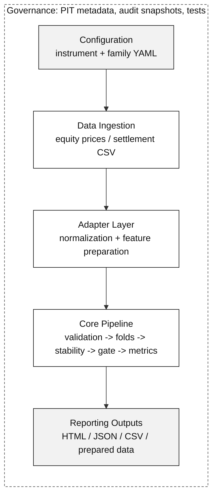

# Janus IEEE Architecture Diagram

เวอร์ชันนี้ออกแบบให้เหมาะกับรายงานหรือ paper แบบ IEEE มากกว่า diagram เต็มใน `docs/architecture_diagram.md` โดยลดจำนวน node, ใช้ข้อความสั้น, ใช้สีแบบ grayscale และจัด layout แนวตั้งเพื่อให้ export แล้ววางได้ในความกว้างประมาณ `\columnwidth`

ไฟล์ Mermaid source แยกอยู่ที่ `docs/architecture_diagram_ieee.mmd` และมี SVG draft สำหรับ preview/export อยู่ที่ `docs/images/janus_architecture_ieee.svg`

## Recommended Caption

**Fig. X. Architecture of the Janus quantitative pipeline.** Instrument and family-level configurations determine the data ingestion and adapter paths. The prepared dataset is then processed by validation, walk-forward fold construction, stability diagnostics, regime-gate checks, and performance metrics before producing reproducible reporting artifacts. Point-in-time metadata, audit snapshots, and tests support governance across the pipeline.

## LaTeX Placement Example

```latex
\begin{figure}[t]
  \centering
  \includegraphics[width=\columnwidth]{images/janus_architecture_ieee.pdf}
  \caption{Architecture of the Janus quantitative pipeline.}
  \label{fig:janus_architecture}
\end{figure}
```

## Mermaid Source



## Export Suggestion

สำหรับ IEEE แนะนำ export เป็น PDF หรือ SVG แล้วค่อยแปลงตาม requirement ของ conference/journal เพื่อให้เส้นและตัวอักษรไม่แตกเมื่อย่อ:

```bash
mmdc -i docs/architecture_diagram_ieee.mmd -o docs/images/janus_architecture_ieee.pdf -b white
```

ถ้าใช้ SVG draft ที่เตรียมไว้ ให้แปลงเป็น PDF ก่อนใส่ใน IEEE LaTeX template เพื่อหลีกเลี่ยงปัญหา package compatibility ของ `.svg`
