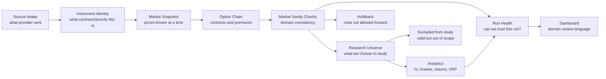
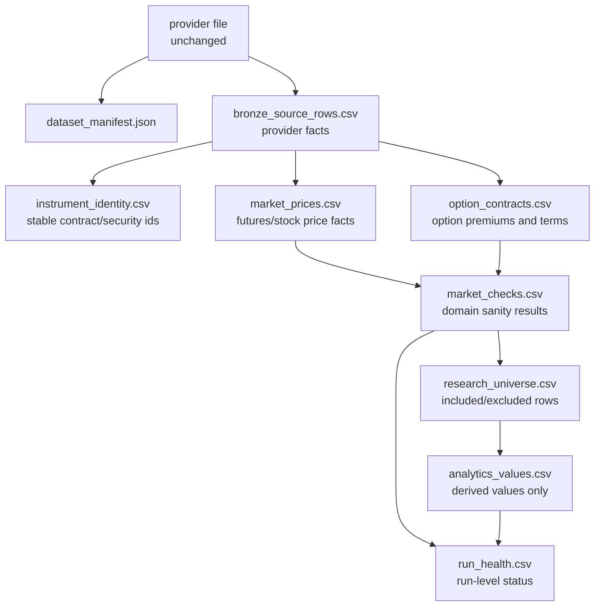
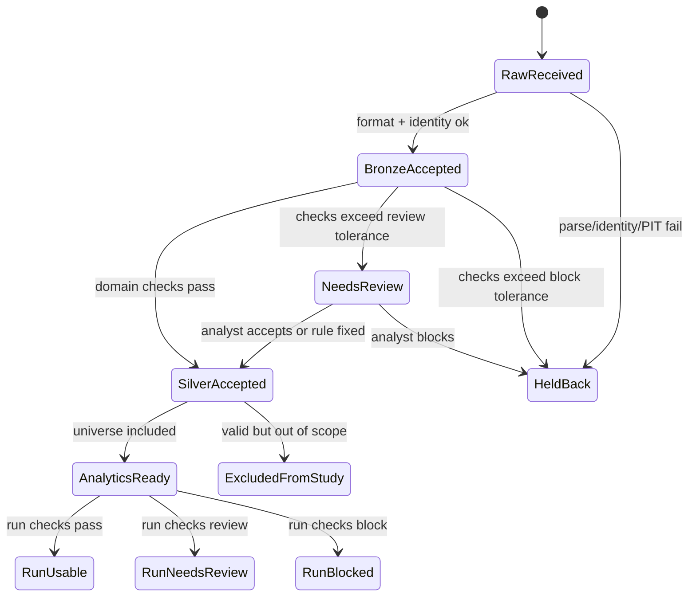

# CSV Storage and Bounded Context Redesign

> Purpose: reset trust in prepared data by separating raw facts, domain checks,
> derived analytics, and dashboard language. This is a design agreement before
> changing the pipeline or UI.
>
> Date: 2026-06-26
> Status: draft for domain sign-off
> Companion: `docs/design/data_test_measurement_criteria.md`

---

## 0. Why This Exists

The current `prepared.csv` is too wide and mixes too many meanings in one table:

- raw provider fields
- normalized fields
- support futures rows
- option rows
- pricing inputs
- derived Greeks
- validation flags
- run-level observability fields

That makes one bad assumption look like normal data. The WTI run showed this clearly:
IV and PCP checks were red, but the run was still presented as mostly usable.

The new design makes bad data harder to trust by accident:

1. keep source facts separate from derived analytics
2. use explicit units and ISO time formats
3. reduce table width by splitting domain tables
4. make row status and run status visible in domain language
5. treat all existing prepared outputs as untrusted until rebuilt

---

## 1. Shared Bounded Contexts

These contexts are the language boundary between domain review, data pipeline, and
dashboard. A term should mean one thing inside one context.



| Context | Owns | Does not own |
| --- | --- | --- |
| Source Intake | original values, provider field names, file hash, load time | IV scaling decisions, option math |
| Instrument Identity | product/security identity, contract month, expiry, right, strike | price validation |
| Market Snapshot | dated price facts and availability time | strategy metrics |
| Option Chain | option contract rows and premiums | return series, dashboard status |
| Market Sanity Checks | IV mismatch, call/put mismatch, intrinsic value checks, missing support price | research filtering |
| Research Universe | DTE, price, spread, delta, liquidity selection | quarantine or data correctness |
| Analytics | canonical IV, Greeks, returns, volatility features | raw source truth |
| Run Health | pass/review/block decision for the whole run | row-level formula ownership |
| Dashboard | domain review workflow | technical function names |

Important wording:

- **Holdback**: data failed a correctness rule and must not feed analytics.
- **Excluded from study**: data may be valid but is outside the chosen research universe.
- **Needs review**: data can be inspected but should not be trusted as final.
- **Blocked**: data should not be used for backtest decisions.

---

## 2. Storage Shape: From One Wide CSV to a CSV Bundle

The replacement is not one new mega-CSV. It is a bundle of narrow CSVs with a
manifest. CSV remains easy to inspect, but each file has one grain and one purpose.



Recommended bundle layout:

```text
data/clean/<family>/<instrument>/<dataset_id>/
  dataset_manifest.json
  bronze_source_rows.csv
  instrument_identity.csv
  market_prices.csv
  option_contracts.csv
  market_checks.csv
  research_universe.csv
  analytics_values.csv
  run_health.csv
```

The bundle must be reproducible:

- `dataset_id` should be content-addressed or include source hash.
- `dataset_manifest.json` records source file hash, schema versions, config hash,
  code version, and accepted unit assumptions.
- Old `prepared.csv` can still be exported for compatibility, but it must be
  labelled as a view, not the source of truth.

---

## 3. CSV Format Contract

All canonical CSVs must follow the same low-friction rules.

| Area | Rule |
| --- | --- |
| Encoding | UTF-8 |
| Delimiter | comma for canonical CSV; provider pipe files remain raw source |
| Header | `snake_case`, stable, no spaces |
| Date | `YYYY-MM-DD` |
| Timestamp | RFC 3339 UTC, e.g. `2024-09-25T03:00:00Z` |
| Time zone | UTC only in canonical files |
| Decimal | dot decimal separator |
| Missing value | empty field |
| Boolean | `true` / `false` lowercase |
| Enum | lowercase controlled values, e.g. `option`, `future`, `call`, `put` |
| Percent/rate | store decimal units, not percent strings |
| Raw provider units | preserve in bronze with explicit `_raw` and `_unit` columns |

Unit rule:

```text
Do not store a number unless the unit is obvious from the column name or declared
in the manifest.
```

Examples:

| Meaning | Bad | Good |
| --- | --- | --- |
| IV from provider percent | `iv_provided = 58.26110` | `iv_raw = 58.26110`, `iv_raw_unit = percent` |
| Canonical IV decimal | `iv = 58.26110` | `iv_decimal = 0.582611` |
| Price | `price` in mixed tables | `option_premium`, `futures_settlement`, `stock_close` |
| Timestamp | `2024-09-25 03:00:00+00:00` | `2024-09-25T03:00:00Z` |

---

## 4. Narrow Table Design

### 4.1 `bronze_source_rows.csv`

Purpose: immutable facts from the source after only mechanical parsing.

Grain: one provider row.

Required columns:

| Column | Meaning |
| --- | --- |
| `source_row_id` | stable hash/key for the row |
| `provider` | source name |
| `source_file_hash` | input file hash |
| `source_line_number` | line number where available |
| `as_of_date` | date described by the row |
| `available_at` | when the row is allowed to be known |
| `ingested_at` | when Janus loaded it |
| `provider_payload_json` | compact JSON of original provider fields, or raw columns in a provider-specific bronze view |

Rule: bronze can preserve provider-specific width. Downstream canonical tables
must not inherit all provider columns.

### 4.2 `instrument_identity.csv`

Purpose: stable identity, separated from prices and analytics.

Grain: one instrument or contract identity.

Required columns:

| Column | Meaning |
| --- | --- |
| `instrument_id` | stable Janus id |
| `family` | `equity`, `equity_option`, `future`, `futures_option` |
| `provider_symbol` | provider symbol or product id |
| `root` | futures root when applicable |
| `hub` | futures hub when applicable |
| `delivery_month` | ISO date when applicable |
| `expiry` | ISO date when applicable |
| `right` | `call`, `put`, or empty |
| `strike` | decimal strike, empty for non-options |

### 4.3 `market_prices.csv`

Purpose: source price facts for underlying instruments.

Grain: one instrument per `as_of_date` per `available_at`.

Required columns:

| Column | Meaning |
| --- | --- |
| `price_row_id` | stable row id |
| `instrument_id` | underlying instrument id |
| `as_of_date` | date described |
| `available_at` | knowledge time |
| `price_type` | `settlement`, `close`, `adjusted_close`, `bid`, `ask` |
| `price` | numeric value |
| `currency` | e.g. `USD` |
| `source_row_id` | lineage to bronze |

### 4.4 `option_contracts.csv`

Purpose: option contract facts and option premiums.

Grain: one option contract per `as_of_date` per `available_at`.

Required columns:

| Column | Meaning |
| --- | --- |
| `option_row_id` | stable row id |
| `option_instrument_id` | option contract id |
| `underlying_instrument_id` | mapped underlying id |
| `as_of_date` | date described |
| `available_at` | knowledge time |
| `option_premium` | option settlement/close premium |
| `premium_type` | `settlement`, `mid`, `last`, `close` |
| `iv_raw` | provider IV as supplied |
| `iv_raw_unit` | `percent`, `decimal`, or empty |
| `delta_raw` | provider delta as supplied |
| `source_row_id` | lineage to bronze |

Rule: `option_premium` and underlying price never share a generic `price` column in
canonical option tables.

### 4.5 `market_checks.csv`

Purpose: domain sanity checks, one check per row or per pair.

Grain: one check result.

Required columns:

| Column | Meaning |
| --- | --- |
| `check_id` | stable check id |
| `entity_id` | row, contract, pair, date, or run id being checked |
| `context` | bounded context, e.g. `option_chain` |
| `check_name` | domain label, e.g. `volatility_mismatch` |
| `status` | `pass`, `review`, `block`, `not_checked` |
| `severity` | `low`, `medium`, `high` |
| `observed_value` | numeric or short value |
| `expected_value` | numeric or short value |
| `tolerance` | domain tolerance |
| `reason` | short domain reason |

Rule: checks are data. They should not be hidden as dozens of `_flag` columns on a
wide table.

### 4.6 `research_universe.csv`

Purpose: separate study selection from correctness.

Grain: one option or market row decision.

Required columns:

| Column | Meaning |
| --- | --- |
| `entity_id` | row or contract id |
| `universe_id` | named research universe |
| `included` | `true` / `false` |
| `decision` | `included`, `excluded_from_study`, `held_back` |
| `reason` | e.g. `dte_outside_range`, `premium_too_small`, `volatility_blocked` |

### 4.7 `analytics_values.csv`

Purpose: derived values only.

Grain: one named value per entity per time.

Required columns:

| Column | Meaning |
| --- | --- |
| `analytics_id` | stable row id |
| `entity_id` | contract, underlying, date, or run id |
| `as_of_date` | date described |
| `available_at` | knowledge time |
| `value_name` | e.g. `iv_decimal`, `delta`, `gamma`, `return_decimal` |
| `value` | numeric value |
| `unit` | `decimal`, `usd`, `per_year`, etc. |
| `method` | e.g. `provider_scaled`, `black76_solved`, `daily_return` |
| `input_check_status` | worst check status for inputs |

Rule: if the input is `review` or `block`, analytics either should not be computed,
or must carry `input_check_status` so consumers cannot miss it.

### 4.8 `run_health.csv`

Purpose: one row per run with domain status.

Required columns:

| Column | Meaning |
| --- | --- |
| `run_id` | run id |
| `dataset_id` | input dataset bundle |
| `family` | asset family |
| `instrument` | domain instrument label |
| `date_start` | ISO date |
| `date_end` | ISO date |
| `status` | `usable`, `needs_review`, `blocked` |
| `worst_area` | domain area causing status |
| `blocked_count` | count of blocking checks |
| `review_count` | count of review checks |
| `held_back_rows` | rows not allowed forward |

---

## 5. Data Trust Flow



Nothing should move from `HeldBack` to analytics without a recorded decision.

---

## 6. Dashboard Language Shift

The dashboard should speak in domain review language. Technical names can remain in
tooltips or details.

| Current / technical | Dashboard label | Domain meaning |
| --- | --- | --- |
| `data_quality.status` | Run readiness | Can this run be used? |
| `option_quality` | Option market checks | Are option prices internally consistent? |
| `iv_flag` | Volatility mismatch | Provider IV differs from Janus-solved IV beyond tolerance |
| `_pcp_flag` | Call/put price mismatch | Call and put prices disagree with parity assumptions |
| `_premium_quality_flag` | Premium below fair minimum | Premium is below intrinsic value or economic bound |
| `underlying_map` | Missing futures price match | Option cannot find its matching underlying futures price |
| `coverage_shortfall` | Missing market days | Requested date window has missing observations |
| `quarantine` | Held back rows | Rows not allowed into prepared data |
| `universe_drop_rows` | Excluded from study | Valid rows outside research selection |
| `CDC` | Change audit | What changed between stages |
| `break ledger` | Review queue | Issues needing analyst/provider decision |

Recommended dashboard statuses:

| Status | Meaning | UI tone |
| --- | --- | --- |
| `usable` | no blocking checks; review checks below accepted budget | green |
| `needs_review` | not automatically trusted; analyst should inspect | amber |
| `blocked` | should not feed backtest/report decisions | red |
| `not_checked` | missing check, not equivalent to pass | gray/amber |

Dashboard first screen should answer:

1. Can I use this run?
2. Which market area is unreliable?
3. How many rows were held back?
4. How many rows were merely excluded from the research universe?
5. Which assumptions were used for units, especially IV?

---

## 7. IV Scaling and Unit Risk

This is the most urgent trust issue.

Different providers may encode IV differently:

| Provider style | Example | Canonical decimal |
| --- | --- | --- |
| percent points | `58.26110` | `0.582611` |
| decimal | `0.582611` | `0.582611` |
| percent string | `58.26110%` | `0.582611` |

New rule:

```text
No loader may divide or multiply IV without recording the raw unit assumption in
the dataset manifest and preserving the raw value.
```

Required manifest fields:

```json
{
  "unit_assumptions": {
    "iv_raw": {
      "provider_field": "OPTION_VOLATILITY",
      "raw_unit": "percent",
      "canonical_unit": "decimal",
      "scale_factor": 0.01,
      "approved_by": null,
      "approved_at": null
    }
  }
}
```

Required checks:

- `iv_raw_unit_known`: block if unknown
- `iv_decimal_range`: review/block when canonical IV is outside accepted range
- `iv_provider_vs_solved`: review/block when provider IV and solved IV disagree
- `iv_scaling_smoke_test`: detect likely 100x or 0.01x scaling mistakes

Scaling smoke examples:

| Symptom | Likely cause |
| --- | --- |
| most IV values are `> 10` | percent was treated as decimal |
| most IV values are `< 0.001` | decimal was divided by 100 again |
| provider IV differs from solved IV by about 100x | unit assumption mismatch |
| deep ITM rows dominate IV mismatches | solver/model/timing assumptions may differ; inspect separately |

---

## 8. Does This Affect Stocks and Equity Options?

Treat the answer as "unknown until audited."

Likely risk by family:

| Family | IV scaling risk | Other trust risks |
| --- | --- | --- |
| futures options | high | underlying futures mapping, Black-76 assumptions, PCP, contract month matching |
| equity options | medium/high | provider IV unit conventions, spot/adjusted close choice, dividend yield, snapshot coverage |
| equities | low for IV, high for price history | adjusted close vs traded close, split/dividend timing, survivorship, missing delisting data |
| futures | low for IV, medium for price | roll construction, settlement vs last trade, contract identity |

Audit order:

1. WTI futures options: freeze and rebuild a small known window.
2. Equity options: inspect provider IV raw unit and solve/check against premiums.
3. Equities: audit adjusted/unadjusted price policy and split timing.
4. Futures: audit roll and settlement availability timing.

Until an audit passes, old prepared outputs should be labelled:

```text
Historical prepared data: untrusted, diagnostic only.
```

---

## 9. Acceptance Criteria Before Implementation

Domain sign-off:

- IV raw unit for each provider is explicitly approved.
- Dashboard labels above are accepted or renamed.
- `usable`, `needs_review`, `blocked`, and `not_checked` meanings are accepted.
- Holdback vs excluded-from-study distinction is accepted.
- WTI support futures rows are accepted as source context rows, but not mixed with
  option rows in the same wide analytics table.

Engineering sign-off:

- New CSV bundle schemas are versioned.
- Old `prepared.csv` is downgraded to compatibility export.
- Run status includes option-market checks, not only generic data quality checks.
- Unit assumptions are stored in manifest and tested.
- Equity/equity-option audit has a minimal fixture before refactor touches UI.

---

## 10. Immediate Implementation Plan

1. Add unit registry and manifest fields for IV, price, return, and rate columns.
2. Add WTI fixture that proves the current run must be `blocked` or
   `needs_review`, not silently usable.
3. Add `option_market_checks` status to `summary.json`.
4. Change dashboard run status to domain statuses.
5. Add CSV bundle writer behind a feature flag.
6. Keep old `prepared.csv` export as compatibility output with a warning in
   manifest/report.
7. Run the same audit on equity options and stock price loaders before presenting
   historical results as trusted.

---

## 11. Reconciliation With `csv_diff/report.md`

The external CSV diff report is useful as a human-readable comparison between
the raw WTI file and the current prepared output. Fold these points into the
redesign:

- Raw provider files may use provider-native delimiter and display labels.
- Canonical data should use ISO dates, stable names, explicit units, and source
  lineage.
- `prepared.csv` is too wide: the report's 13-to-62 column expansion is exactly
  why the new design splits data into narrow context tables.
- IV scale must be explicit: raw provider IV, raw unit, canonical IV, and scale
  factor must all be recorded.
- Delta source must be explicit: provider delta and model delta are different
  values and should not share one dashboard label.
- Row index is never a valid reconciliation key. Joins must use domain identity
  such as date, contract identity, right, strike, and knowledge time.

Corrections before treating that report as ground truth:

- The WTI raw file does contain futures rows. They are not invented by Janus;
  Janus currently mixes source futures rows and option rows into one wide
  prepared view. In the redesign, futures rows belong in `market_prices.csv`
  and option rows belong in `option_contracts.csv`.
- Support futures rows should not be described as injected unless the pipeline
  actually synthesizes a missing row. The current observed first prepared row is
  primarily a sorting/grain-mixing symptom.
- `term_structure_slope` is currently based on futures settlement prices, not a
  completed volatility surface.
- VRP sign and formula must be defined once in the analytics contract before it
  appears on the dashboard.

Rules added from this review:

1. Every exported row must carry source lineage: source file hash and source row
   id or line number where available.
2. Compatibility exports must include a warning that row order is not stable
   across contexts.
3. Dashboard labels must distinguish:
   - provider IV vs model IV
   - provider delta vs model delta
   - held-back rows vs excluded-from-study rows
   - source futures rows vs option contract rows
