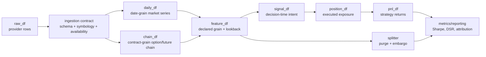
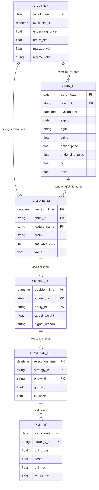
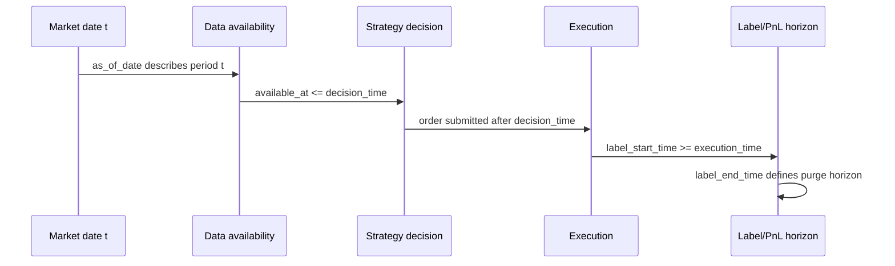

# Janus - Data Structure Redesign Reading Map

> Purpose: reading guide for the data-structure redesign phase.
> Companions:
> - `docs/design/audit_findings_pre_data_structure.md`
> - `docs/design/leakage_guard_design.md`
> Date: 2026-06-16

---

## How to read this redesign

Read the redesign as a data-contract problem first, and a code-refactor problem second.
Most current risks come from unclear grain, missing strategy P&L, and incomplete
point-in-time timing rules. The goal is to make invalid data flow structurally hard.

Suggested reading order:

1. `audit_findings_pre_data_structure.md` - what is broken or weak today.
2. `leakage_guard_design.md` - how to prevent non-causal feature computation.
3. This file - how to organize the redesigned data structures and where to tighten them.

---

## Target pipeline map



Key rule: Stage 4 must consume `pnl_df`, not underlying `return_std`. Until
`signal_df -> position_df -> pnl_df` exists, strategy metrics should be labelled as
market diagnostics only.

---

## Grain map



Tightening point: every table should declare its primary key and grain. A rolling,
expanding, or time-series statistical operation should reject any input whose grain is
not date-unique unless the feature explicitly declares a contract-level time series.

---

## PIT timing map



Required invariant:

```text
as_of_date <= available_at <= decision_time <= execution_time <= label_end_time
```

This invariant is stricter than "no future rows in rolling windows". A feature can be
causal by row order and still leak if it uses data that was not available at the
strategy's decision time.

---

## Improvement priorities

### P0 - Must fix before trusting backtest metrics

1. Add the strategy layer: `signal_df`, `position_df`, `pnl_df`.
   - Current Stage 4 should stop presenting Sharpe/DSR as strategy performance.
   - Reports should distinguish "market diagnostics" from "strategy metrics".

2. Make PIT fields mandatory.
   - Required columns: `as_of_date`, `available_at`, `decision_time`.
   - For labels or P&L: add `execution_time`, `label_start_time`, `label_end_time`.
   - All joins from external/events/reference data must use `available_at <= decision_time`.

3. Enforce grain before feature computation.
   - `daily_df`: one row per `as_of_date`.
   - `chain_df`: one row per contract per `as_of_date`.
   - Time-series transforms should accept only date-sorted, date-unique series unless
     a feature explicitly declares contract-level time-series grain.

4. Extend leakage tests beyond future perturbation.
   - Future perturbation: changing future rows must not change past outputs.
   - Future truncation: computing on `[0:t]` must match full-sample output at `t`.
   - Same-date shuffle: reordering contracts inside one date must not change date-level features.
   - Availability violation: rows with `available_at > decision_time` must be rejected.

5. Make purge automatic from metadata.
   - Purge should use:
     `max(feature_lookback, label_horizon, availability_lag, execution_delay, event_embargo)`.
   - Feature lookback alone is not enough.

### P1 - Strongly recommended hardening

1. Wire `VersionedCache` into `run_pipeline`.
   - Backtests should default to a fixed `data_version`, not `latest`.
   - `latest` is useful for exploration, but dangerous for reproducible validation.

2. Enforce schema dtypes at ingestion.
   - Current schema checks column presence only.
   - Add dtype coercion, timezone normalization, and failure on invalid required fields.

3. Enforce symbology at ingestion.
   - Unknown `product_id` or duplicate mapping should fail before adapters run.

4. Validate option premium separately from underlying price.
   - `price_std` may be overwritten with the underlying.
   - Option-specific validation must check `option_price > 0`, bid/ask sanity, and intrinsic bounds.

5. Replace generic date aggregation with feature-specific rules.
   - `mean` is not always valid for option chains.
   - VRP, skew, and term-structure features should declare their contract selection rule:
     ATM, front expiry, fixed tenor, delta bucket, or surface interpolation.

### P2 - Reporting and operational polish

1. Sanitize `run_id` before writing output paths.
2. Escape JSON and HTML payloads in reports.
3. Add report badges:
   - `PIT-safe: pass/fail`
   - `grain-safe: pass/fail`
   - `strategy-pnl-present: pass/fail`
   - `cache-version-fixed: pass/fail`
4. Move offline HMM/GMM checks into a clearly labelled diagnostics section.
   - They must not feed back into fold creation, rule tuning, or pass/fail gates unless
     they are trained only on the allowed training window.

---

## Acceptance criteria for the redesign

The redesign is not complete until these statements are true:

1. No feature can be computed without declared `grain`, `lookback_bars`, and timing fields.
2. No rolling/expanding transform can run directly on a many-rows-per-date option chain.
3. No backtest can read mutable `latest` data unless explicitly marked exploratory.
4. No strategy metric is reported without `pnl_df`.
5. No validation fold can include training rows whose feature or label horizon overlaps validation.
6. Reordering same-date chain rows does not change date-level features.
7. Removing future data does not change past features.
8. Data unavailable at `decision_time` cannot join into signals.

---

## Recommended report structure

1. Executive summary - what changes and why.
2. Current failure modes - link back to audit findings.
3. Target data structures - include the pipeline, grain, and PIT diagrams above.
4. Contracts and invariants - keys, timing rules, grain rules, schema rules.
5. Leakage guard tests - dynamic tests, static lint, CI gates.
6. Migration plan - implement `daily_df`/`chain_df`, then feature registry, then strategy P&L.
7. Acceptance checklist - the criteria above.

