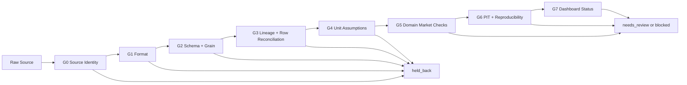

# Data Test Measurement Criteria

> Purpose: define measurable test gates before rebuilding CSV storage,
> dashboard language, and data trust status.
>
> Date: 2026-06-26
> Status: draft for domain and engineering sign-off

---

## 0. Test Goal

The goal is not only "tests pass." The goal is to answer:

1. Can this dataset be trusted for analysis?
2. If not, which market area failed?
3. Is the problem a source-data issue, a transformation issue, a unit issue, or a
   research-universe choice?
4. Did the dashboard show the same risk that the tests found?

The output of every data test run must end with one domain decision:

| Decision | Meaning |
| --- | --- |
| `usable` | no blocking issue and review issues are within accepted budget |
| `needs_review` | not trusted automatically; analyst review required |
| `blocked` | must not feed backtests, reports, or dashboard claims |
| `not_checked` | critical check did not run; never equivalent to pass |

---

## 1. Gate Map



Each gate produces:

- metric values
- pass/review/block status
- top failing examples
- artifact path
- owner or review queue label

---

## 2. Severity Rules

Use the same severity language across tests, summary, and dashboard.

| Severity | Test result | Run effect |
| --- | --- | --- |
| P0 | critical trust invariant failed | `blocked` |
| P1 | domain risk above review budget | `needs_review` or `blocked` by threshold |
| P2 | diagnostic issue or polish gap | `needs_review` only when repeated |

Run decision logic:

```text
if any P0 check is block:
    run_status = blocked
elif any critical check is not_checked:
    run_status = needs_review
elif any P1 metric is above review budget:
    run_status = needs_review
else:
    run_status = usable
```

No test may silently convert `not_checked` into `pass`.

---

## 3. G0 Source Identity

Purpose: prove we know exactly which source file or source snapshot is being tested.

| Metric | Pass | Review | Block |
| --- | --- | --- | --- |
| `source_hash_present_rate` | 100% | n/a | < 100% |
| `source_row_count_recorded` | true | n/a | false |
| `provider_declared` | true | n/a | false |
| `source_schema_version_declared` | true | n/a | false |
| `mutable_latest_used_for_official_run` | false | true for exploration | true for official backtest |

Required evidence:

- source path or provider snapshot id
- source file hash
- source row count
- provider name
- source schema version

WTI incident test:

- Assert the raw WTI file contains futures rows and option rows.
- Assert any report claiming "raw has options only" fails factual review.

---

## 4. G1 Format

Purpose: canonical CSVs are machine-readable without guessing.

| Metric | Pass | Review | Block |
| --- | --- | --- | --- |
| `header_snake_case_rate` | 100% | n/a | < 100% |
| `date_iso_rate` | 100% | n/a | < 100% |
| `timestamp_rfc3339_utc_rate` | 100% where timestamp exists | < 100% non-critical column | < 100% critical column |
| `boolean_canonical_rate` | 100% | n/a | < 100% |
| `numeric_parse_success_rate` | 100% critical numeric fields | 99.9% to <100% optional fields | < 100% critical fields |
| `missing_value_policy_rate` | 100% | n/a | < 100% |

Canonical rules:

- date: `YYYY-MM-DD`
- timestamp: `2024-09-25T03:00:00Z`
- boolean: `true` / `false`
- missing: empty field
- decimal separator: `.`

Provider raw files may keep provider-native delimiter and display names, but those
rules must be isolated to bronze/source context.

---

## 5. G2 Schema and Grain

Purpose: every table has one row meaning and one primary key.

| Metric | Pass | Review | Block |
| --- | --- | --- | --- |
| `required_column_coverage` | 100% | n/a | < 100% |
| `primary_key_duplicate_count` | 0 | n/a | > 0 |
| `mixed_grain_detected` | false | n/a | true |
| `unexpected_column_count` | 0 for strict table | <= accepted extension list | unknown columns in strict table |
| `dtype_contract_pass_rate` | 100% critical fields | optional fields only | critical field failure |

Table-specific grain:

| Table | Grain | Must not contain |
| --- | --- | --- |
| `market_prices.csv` | one underlying/security price per date and knowledge time | option premiums, Greeks |
| `option_contracts.csv` | one option contract per date and knowledge time | underlying-only futures rows |
| `market_checks.csv` | one check result | raw source payload |
| `analytics_values.csv` | one derived value per entity per time | raw provider display fields |
| `run_health.csv` | one row per run | row-level option contracts |

WTI incident test:

- Futures rows from raw WTI must land in `market_prices.csv`.
- Option rows from raw WTI must land in `option_contracts.csv`.
- A compatibility `prepared.csv` may mix them only if it is labelled as a view and
  carries a row-order warning.

---

## 6. G3 Lineage and Row Reconciliation

Purpose: prove every canonical value can be traced to a source and row counts are
explainable.

| Metric | Pass | Review | Block |
| --- | --- | --- | --- |
| `lineage_coverage_rate` | 100% | n/a | < 100% |
| `source_row_id_coverage_rate` | 100% where available | accepted missing line numbers only | unexplained missing source ids |
| `raw_to_canonical_reconciled_rate` | 100% | n/a | < 100% |
| `unexplained_row_drop_count` | 0 | n/a | > 0 |
| `unexplained_row_add_count` | 0 | n/a | > 0 |
| `row_index_join_used` | false | n/a | true |

Reconciliation equation:

```text
raw_rows
  = canonical_rows
  + held_back_rows
  + intentionally_ignored_source_rows
```

For option rows:

```text
raw_option_rows
  = option_contract_rows
  + option_rows_held_back
  + option_rows_intentionally_ignored
```

Research-universe exclusions happen after canonical option rows are created, so
they must not be counted as raw-to-canonical row loss.

WTI incident test:

- Raw option row `strike=35`, `right=call`, `delivery_month=2024-11-01`,
  `as_of_date=2024-09-25` must reconcile by domain key, not by row index.
- First prepared row being a futures row must not cause raw option row 1 to be
  compared with prepared row 1.

---

## 7. G4 Unit Assumptions

Purpose: stop silent 100x, 0.01x, rate, and price-unit mistakes.

| Metric | Pass | Review | Block |
| --- | --- | --- | --- |
| `unit_assumption_coverage_rate` | 100% critical numeric fields | optional fields only | critical field missing unit |
| `iv_raw_unit_known_rate` | 100% | n/a | < 100% |
| `iv_scale_factor_declared` | true | n/a | false |
| `iv_scale_roundtrip_error_max` | <= 1e-12 for deterministic scale | <= 1e-9 | > 1e-9 |
| `iv_scale_smoke_status` | pass | suspicious | likely_100x_error |
| `rate_unit_declared` | true for rates | n/a | false |

Critical numeric fields:

- option IV
- option premium
- underlying price
- strike
- delta
- interest rate
- return
- volatility

IV unit tests:

| Scenario | Expected result |
| --- | --- |
| raw IV `58.26110`, unit `percent` | canonical IV `0.582611` |
| raw IV `0.582611`, unit `decimal` | canonical IV `0.582611` |
| raw IV `58.26110`, unit unknown | `blocked` |
| canonical IV median > 10 | likely percent treated as decimal, `blocked` |
| canonical IV median < 0.001 while raw median is plausible decimal | likely divided twice, `blocked` |

WTI incident test:

- `OPTION_VOLATILITY=58.26110` must preserve:
  - `iv_raw=58.26110`
  - `iv_raw_unit=percent`
  - `iv_decimal=0.582611`
  - manifest scale factor `0.01`

Equity option rule:

- Do not assume the provider IV unit. The equity-option loader must declare it in
  the unit registry and prove it with a fixture.

---

## 8. G5 Domain Market Checks

Purpose: catch economically suspicious option and market data before analytics
or dashboard claims.

### 8.1 Common Market Checks

| Metric | Pass | Review | Block |
| --- | --- | --- | --- |
| `price_positive_violation_rate` | 0 | <= 0.1% optional contexts | > 0 critical prices |
| `missing_market_day_rate` | <= accepted budget | budget to LTPD | > LTPD |
| `duplicate_identity_rate` | 0 | n/a | > 0 |
| `pit_availability_violation_rate` | 0 | n/a | > 0 |

### 8.2 Option Checks

Initial budgets must be reviewed by domain owner. These are starter gates.

| Metric | Pass | Needs review | Block |
| --- | --- | --- | --- |
| `underlying_match_missing_rate` | 0 | > 0 and <= 0.1% | > 0.1% |
| `premium_below_intrinsic_rate` | 0 | > 0 and <= 0.05% | > 0.05% |
| `delta_sign_violation_rate` | 0 | > 0 and <= 0.01% | > 0.01% |
| `abs_delta_gt_one_rate` | 0 | > 0 and <= 0.01% | > 0.01% |
| `call_put_pair_missing_rate` | <= 0.1% in parity universe | <= 1% | > 1% |
| `pcp_mismatch_rate` | <= 1% in parity universe | <= 5% | > 5% |
| `iv_provider_model_mismatch_rate` | <= 1% in IV-eligible universe | <= 5% | > 5% |
| `iv_unsolved_rate` | <= 1% in IV-eligible universe | <= 5% | > 5% |
| `iv_hard_range_violation_rate` | 0 | > 0 and <= 0.05% | > 0.05% |

Important: IV and PCP rates should be computed on explicit eligible universes, not
blindly across deep ITM/OTM or expired rows. If the eligible universe is missing,
the check status is `not_checked`, not pass.

IV-eligible universe should declare at least:

- DTE range
- minimum premium
- moneyness or delta band
- required underlying match
- valid rate assumption

WTI incident test:

- A run with `iv_flag_rate` around 77% and `pcp_mismatch_rate` around 74% must not
  show as simply "available".
- If those rates are outside the selected eligible universe, the dashboard must
  say "excluded from volatility surface" or "needs review", not silently hide it.

### 8.3 Equity and Stock Checks

| Family | Required checks |
| --- | --- |
| equities | adjusted vs unadjusted close policy, split timing, dividend timing, delisting flag coverage |
| equity options | IV unit registry, spot/underlying price source, dividend yield assumption, option premium bounds, PCP in eligible universe |
| futures | settlement availability, roll rule, contract identity, term structure source |
| futures options | underlying futures match, futures settlement availability, Black-76 input checks, option premium checks |

---

## 9. G6 PIT and Reproducibility

Purpose: prove the data was knowable at the decision time and the run can be
replayed.

| Metric | Pass | Review | Block |
| --- | --- | --- | --- |
| `available_at_le_decision_time_rate` | 100% | n/a | < 100% |
| `as_of_le_available_at_rate` | 100% for source facts | approved market convention only | unexplained violation |
| `settlement_available_after_session_close` | true for settlement rows | missing exchange calendar/time policy | false |
| `fixed_input_version_present` | true for official runs | false for exploration | false for official runs |
| `rerun_output_hash_match` | true | accepted nondeterministic report-only artifacts | false for data artifacts |
| `config_hash_present` | true | n/a | false |
| `code_version_present` | true | n/a | false |

Required PIT invariant:

```text
as_of_date <= available_at <= decision_time
```

For strategy/PnL tests:

```text
decision_time <= execution_time <= label_end_time
```

Current reporting rule:

- If strategy PnL is absent, dashboard and reports may show market diagnostics,
  but must not label them as strategy performance.
- Settlement data must not infer availability from midnight of `as_of_date`
  unless a data contract explicitly says that convention is correct. For
  settlement rows, `available_at` should be anchored to the exchange/session
  close or configured settlement release time, then converted to UTC.

---

## 10. G7 Dashboard Status Tests

Purpose: make sure UI language reflects data risk.

| Metric | Pass | Review | Block |
| --- | --- | --- | --- |
| `run_status_matches_worst_check` | true | n/a | false |
| `not_checked_visible` | true | n/a | false |
| `technical_label_leak_count` | 0 on first screen | <= accepted detail panels | technical labels dominate first screen |
| `held_back_rows_visible` | true when > 0 | n/a | false |
| `excluded_from_study_visible` | true when > 0 | n/a | false |
| `unit_assumptions_visible` | true for IV/rate-sensitive runs | n/a | false |

Domain labels required on first screen:

| Domain label | May map to |
| --- | --- |
| Run readiness | `run_health.status` |
| Option market checks | IV, PCP, premium, delta, underlying-match checks |
| Volatility mismatch | provider IV vs model IV |
| Call/put price mismatch | PCP check |
| Missing futures price match | underlying map check |
| Held back rows | correctness failures |
| Excluded from study | research universe filters |
| Unit assumptions | IV/rate/price unit registry |

Regression test:

- If `option_market_checks.status = blocked`, the dashboard run row must not show
  green or "available".

---

## 11. Required Test Artifacts

Every data test run should write:

```text
test_report.json
gate_summary.csv
row_reconciliation.csv
unit_assumptions.json
market_checks_summary.csv
failing_examples.csv
dashboard_status_snapshot.json
```

Minimum fields for `gate_summary.csv`:

| Column | Meaning |
| --- | --- |
| `gate` | G0 to G7 |
| `metric` | metric name |
| `value` | observed value |
| `pass_threshold` | pass budget |
| `review_threshold` | review budget |
| `status` | pass/review/block/not_checked |
| `example_artifact` | path to examples |

---

## 12. Priority Test Suites

### P0: WTI Incident Regression

Must run first.

1. Raw WTI contains both futures and option rows.
2. Raw futures rows go to `market_prices.csv`.
3. Raw option rows go to `option_contracts.csv`.
4. IV raw percent is preserved and canonical IV is scaled by manifest rule.
5. Provider delta and model delta are separate.
6. Row reconciliation uses domain keys, never row index.
7. High IV/PCP mismatch rates make run `needs_review` or `blocked`.
8. Dashboard shows domain risk, not merely `option_quality = available`.

### P0: Unit Registry Regression

1. Unknown IV unit blocks.
2. Percent-as-decimal blocks.
3. Decimal-divided-by-100 blocks.
4. Rate unit missing blocks.

### P1: Equity Option Trust Audit

1. Provider IV unit fixture exists.
2. Underlying price source is explicit.
3. Dividend/rate assumptions are recorded.
4. PCP/IV checks run on eligible universe.
5. Snapshot-only option data is not presented as historical backtest-grade data.

### P1: Equity Price Trust Audit

1. Adjusted vs unadjusted close policy is explicit.
2. Split timing warning is visible.
3. Dividend timing is point-in-time.
4. Delisting/survivorship fields are present or marked `not_checked`.

### P2: Compatibility Export

1. `prepared.csv` compatibility export carries warning metadata.
2. It is not used as canonical source of truth.
3. Row order warning is visible in report/manifest.

---

## 13. Exit Criteria

The redesign can move from design to implementation only when:

- P0 WTI incident regression criteria are accepted.
- Unit registry criteria are accepted.
- Dashboard status words are accepted by domain owner.
- Held-back vs excluded-from-study distinction is accepted.
- Equity options and equities have explicit audit suites before old results are
  treated as trusted.
